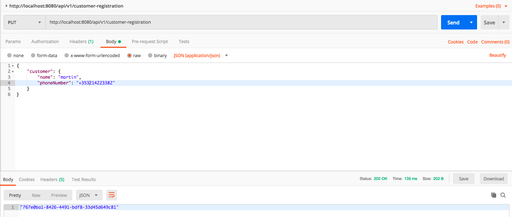
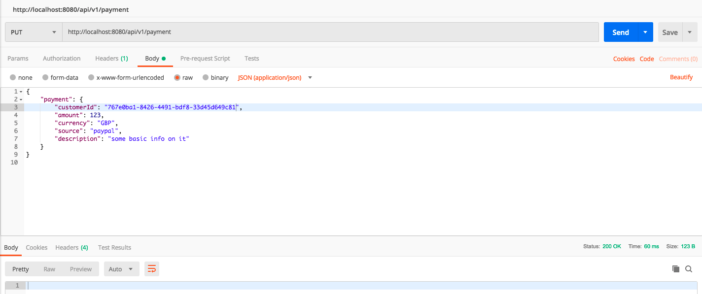

# software-testing

Spring Boot project with Stripe integration and JUNIT5.  
Unit and Integration tests with JUNIT5

Once you have the app running, you can use Postman to test the api endpoints for customer and payment.

Take the response from the customer api and use this as customerId in the payment endpoint

